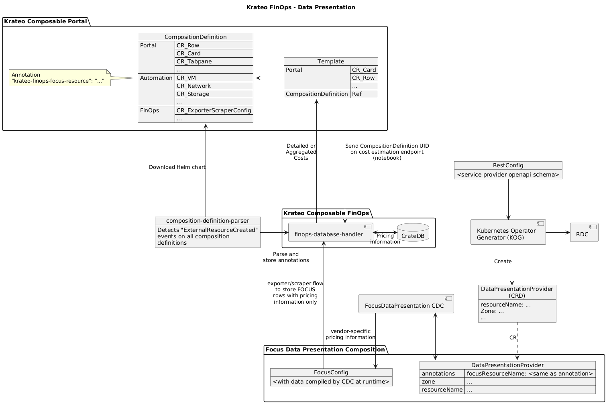

# FinOps Composition Definition Parser
This module is part of the FinOps Data Presentation component, in the Krateo Composable FinOps.

## Summary

1. [Overview](#overview)
2. [Architecture](#architecture)
3. [Configuration](#configuration)

## Overview
This module listens for events from the [eventrouter](https://github.com/krateoplatformops/eventrouter), and when it detects an `ExternalResourceCreated` on an object with apiVersion `core.krateo.io` and kind `CompositionDefinition`, it obtains the chart specified in the custom resource to look for `ANNOTATION_LABEL` annotations in the chart. These labels are then sent to the [finops-database-handler](https://github.com/krateoplatformops/finpos-database-handler) pricing notebook for storage. The labels are used by the frontend notebook to create an endpoint that, when called with the composition definition UID, returns the pricing of the resources in the composition definition. 

The pricing information can be gathered, for example on Azure, through the [Azure Pricing Rest Dynamic Controller Plugin](https://github.com/krateoplatformops/azure-pricing-rest-dynamic-controller-plugin).

## Architecture
In the diagram, this component is the `composition-definition-parser`.



## Configuration
This component requires the following notebook to be available at `URL_DATABASE_HANDLER_PRICING_NOTEBOOK`.

```python
# The notebook is injected with additional lines of code:
# import sys
# from crate import client
# def eprint(*args, **kwargs):
#     print(*args, file=sys.stderr, **kwargs)
# host = sys.argv[1]
# port = sys.argv[2]
# username = sys.argv[3]
# password = sys.argv[4]
# try:
#     connection = client.connect(f"http://{host}:{port}", username=username, password=password)
#     cursor = connection.cursor()
# except Exception as e:
#     eprint('error while connecting to database' + str(e))
#     raise

def main(composition_id : str, json_list : str):
    table_name = 'composition_definition_annotations'
    try: 
        cursor.execute(f"CREATE TABLE IF NOT EXISTs {table_name} (composition_id string, keys object, PRIMARY KEY (composition_id)) WITH (column_policy = 'dynamic')")
    except Exception as e:
        print(f"Could not create table: {str(e)}")
    
    try:
        cursor.execute(f"INSERT INTO {table_name} (composition_id, keys) VALUES (?,?) ON CONFLICT (composition_id) DO UPDATE SET keys = excluded.keys;", [composition_id, json_list])
    except Exception as e:
        print(f"Could not insert keys into table: {str(e)}")
    finally:
        cursor.close()


if __name__ == "__main__":
    composition_id_key_value = sys.argv[5]
    composition_id_key_value_split = str.split(composition_id_key_value, '=')
    if composition_id_key_value_split[0] == 'composition_id':
        composition_id = composition_id_key_value_split[1]

    json_list_key_value = sys.argv[6]
    json_list_key_value_split = str.split(json_list_key_value, '=')
    if json_list_key_value_split[0] == 'json_list':
        json_list = json_list_key_value_split[1]

    main(composition_id, json_list)
``` 